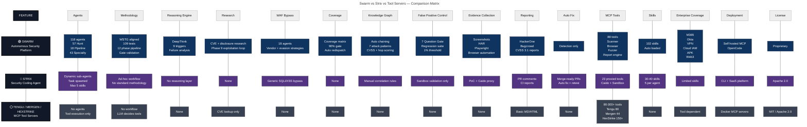

```mermaid
---
title: Swarm vs Strix vs Tool Servers — Comparison Matrix
---

flowchart TB

classDef header fill:#111827,color:white,stroke:#000,stroke-width:2px
classDef swarm fill:#0f3460,color:white,stroke:#16213e
classDef strix fill:#533483,color:white,stroke:#1a1a2e
classDef tools fill:#374151,color:white,stroke:#555
classDef feature fill:#eeeeee,color:#111,stroke:#999


%% HEADER

F[FEATURE]:::header
S[🟢 SWARM<br/>Autonomous Security Platform]:::header
X[🔴 STRIX<br/>Security Coding Agent]:::header
T[⚪ TENGU / MERGEN / HEXSTRIKE<br/>MCP Tool Servers]:::header


F --- S --- X --- T


%% MATRIX MACRO

A1[Agents]:::feature
A2[118 agents<br/>57 Hunt<br/>18 Pipeline<br/>43 Specialty]:::swarm
A3[Dynamic sub-agents<br/>Task spawned<br/>Max 5 skills]:::strix
A4[No agents<br/>Tool execution only]:::tools


B1[Methodology]:::feature
B2[WSTG aligned<br/>109 tests<br/>12 phase pipeline<br/>Gate validation]:::swarm
B3[Ad-hoc workflow<br/>No standard methodology]:::strix
B4[No workflow<br/>LLM decides tools]:::tools


C1[Reasoning Engine]:::feature
C2[DeepThink<br/>9 triggers<br/>Failure analysis]:::swarm
C3[No reasoning layer]:::strix
C4[None]:::tools


D1[Research]:::feature
D2[CVE + disclosure research<br/>Phase 9 exploitation loop]:::swarm
D3[None]:::strix
D4[CVE lookup only]:::tools


E1[WAF Bypass]:::feature
E2[18 agents<br/>Vendor + evasion strategies]:::swarm
E3[Generic SQLi/XSS bypass]:::strix
E4[None]:::tools


F1[Coverage]:::feature
F2[Coverage matrix<br/>90% gate<br/>Auto redispatch]:::swarm
F3[None]:::strix
F4[None]:::tools


G1[Knowledge Graph]:::feature
G2[Auto chaining<br/>7 attack patterns<br/>CVSS + hop scoring]:::swarm
G3[Manual correlation rules]:::strix
G4[None]:::tools


H1[False Positive Control]:::feature
H2[7 Question Gate<br/>Regression suite<br/>1% threshold]:::swarm
H3[Sandbox validation only]:::strix
H4[None]:::tools


I1[Evidence Collection]:::feature
I2[Screenshots<br/>HAR<br/>Playwright<br/>Browser automation]:::swarm
I3[PoC + Caido proxy]:::strix
I4[None]:::tools


J1[Reporting]:::feature
J2[HackerOne<br/>Bugcrowd<br/>CVSS 3.1 reports]:::swarm
J3[PR comments<br/>CI reports]:::strix
J4[Basic MD/HTML]:::tools


K1[Auto Fix]:::feature
K2[Detection only]:::swarm
K3[Merge-ready PRs<br/>Auto fix + retest]:::strix
K4[None]:::tools


L1[MCP Tools]:::feature
L2[88 tools<br/>Scanner<br/>Browser<br/>Fuzzer<br/>Report engine]:::swarm
L3[23 proxied tools<br/>Caido + Sandbox]:::strix
L4[80-300+ tools<br/>Tengu 80<br/>Mergen 44<br/>HexStrike 150+]:::tools


M1[Skills]:::feature
M2[102 skills<br/>Auto loaded]:::swarm
M3[30-40 skills<br/>5 per agent]:::strix
M4[None]:::tools


N1[Enterprise Coverage]:::feature
N2[M365<br/>Okta<br/>VPN<br/>Cloud IAM<br/>APK<br/>Web3]:::swarm
N3[Limited skills]:::strix
N4[Tool dependent]:::tools


O1[Deployment]:::feature
O2[Self hosted MCP<br/>OpenCode]:::swarm
O3[CLI + SaaS platform]:::strix
O4[Docker MCP servers]:::tools


P1[License]:::feature
P2[Proprietary]:::swarm
P3[Apache 2.0]:::strix
P4[MIT / Apache 2.0]:::tools


%% ROW CONNECTIONS

A1 --- A2 --- A3 --- A4
B1 --- B2 --- B3 --- B4
C1 --- C2 --- C3 --- C4
D1 --- D2 --- D3 --- D4
E1 --- E2 --- E3 --- E4
F1 --- F2 --- F3 --- F4
G1 --- G2 --- G3 --- G4
H1 --- H2 --- H3 --- H4
I1 --- I2 --- I3 --- I4
J1 --- J2 --- J3 --- J4
K1 --- K2 --- K3 --- K4
L1 --- L2 --- L3 --- L4
M1 --- M2 --- M3 --- M4
N1 --- N2 --- N3 --- N4
O1 --- O2 --- O3 --- O4
P1 --- P2 --- P3 --- P4
```
