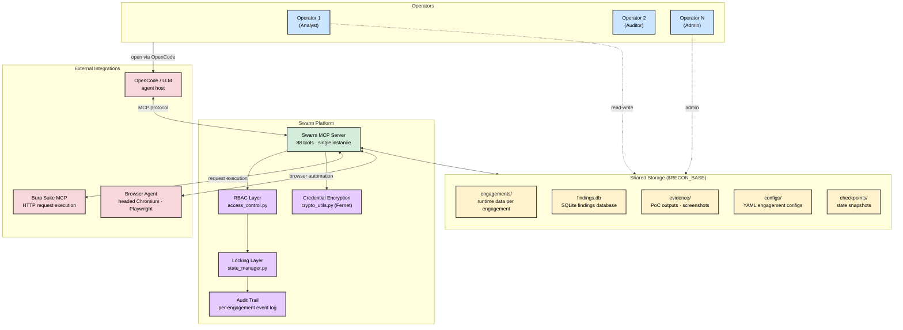

# Enterprise Deployment

Multi-user, multi-team deployment architecture for Swarm.

## Architecture



## RBAC Tiers

| Role | Permissions |
|------|-------------|
| `admin` | Full access: create engagements, manage users, delete data |
| `operator` | Create/edit engagements, run tests, log findings |
| `analyst` | View findings, generate reports, read-only access |
| `auditor` | Read-only: review findings, export evidence |
| `service_account` | Automated API access, specific engagement scope |

## Setup

### 1. Install

```bash
pip install -e server/
```

### 2. Configure data directory

```bash
export SWARM_DATA=/opt/swarm/data
```

### 3. Verify deployment

```bash
python scripts/verify-enterprise.py
```

## RBAC Quickstart

```python
# Grant operator access to an engagement
grant_access("eng-001", "alice", "operator", "editor")

# Grant auditor read-only access
grant_access("eng-001", "bob", "auditor", "guest")

# Check access before modifying
check_access("eng-001", "bob", required_level="editor")
# → {"granted": False, "reason": "Access level 'guest' insufficient"}
```

## Locking

Prevent concurrent destructive operations:

```python
acquire_lock("eng-001", "alice", reason="Running Phase 4 exploitation")
# ... exclusive access ...
release_lock("eng-001", "alice")
```

## State Recovery

```python
# Create checkpoint before risky operations
create_checkpoint("eng-001", "alice", "Before phase-4 recon")

# Rollback if something goes wrong
rollback_to_checkpoint("eng-001", "cp-1741718400-1")
```

## Audit Trail

All access events are logged per-engagement:

```bash
cat $SWARM_ROOT/engagements/eng-001/audit/eng-001_access.log
```

## Requirements

- Python 3.10+
- Shared filesystem (NFS, EFS, or similar) for multi-instance deployments
- `cryptography` package for credential encryption (optional)
