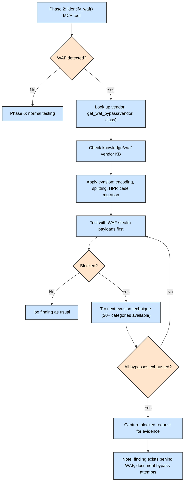

# Test Flow — How Swarm Chooses What to Test

## Overview

Swarm uses a **triage-first, reference-informed** testing strategy drawing from OWASP WSTG v4.2, OWASP Top 10, OWASP API Security Top 10, OWASP ASI, WAF/CRS bypass, CWE, MITRE ATT&CK, NIST, CVSS 3.1/4.0, PortSwigger Academy, and custom payload libraries. Not every endpoint gets every test — the pipeline classifies endpoints by risk, checks disclosed report patterns for the target's tech stack, and dispatches per-class hunt agents with methodology, real-world report references, and WAF-aware payload selection.

118 agents total: 57 `@hunt-*` agents + 18 pipeline + 43 specialty agents.

---

## 12-Phase Pipeline

```
SCOPE(1) → AUTH(2) → INTEL(3) → RECON(4) → SURFACE(5) → HUNT(6) → [DEEPTHINK(7)] → EXPLOIT(8) → [SEARCH(9)] → CAPTURE(10) → VALIDATE(11) → REPORT(12)
                                                                      ├─ group-based testing (1-2 reps per functional group)
                                                                      ├─ Ralph Wiggum loop: every endpoint covered before gate
                                                                      ├─ (parallel) credential-attack
                                                                      └─ multi-auth-context probing (exploit: replay with all sessions)
```

### Phase P1: SCOPE
- Register target domains
- Load engagement config
- Create task tree

### Phase P2: AUTH
- Sign-up / credential validation
- Fingerprint WAF via `identify_waf()` MCP tool
- Look up vendor fingerprints in `knowledge/waf/waf-knowledge-base/02-waf-fingerprints/`
- Apply stealth proxy (headed browser CF bypass) if Cloudflare detected
- Save `auth_analysis` deliverable

### Phase P3: INTEL (passive)
- WHOIS lookup, M365/Azure tenant discovery (`whois` — msftrecon not auto-installed)
- Scopify scope analysis from registered domain
- SPF/DMARC spoofability check (`Spoofy — not auto-installed)`
- Cloud storage bucket enumeration (manual — not auto-installed)
- Runs via `scripts/tools/phase-intel.sh <domain>`
- Output to `$RECON_BASE/<domain>/intel/`
- Skipped: `ip_info` (requires `WHOISXML_API` key)

### Phase P4: RECON
- Subdomain enumeration + DNS bruteforce
- Web crawling, parameter extraction
- Directory bruteforce, 403 bypass, vhost fuzzing
- Zone transfer, takeover scanner, cloud recon
- CVE scanning, secret discovery
- Answer 3 triage questions per endpoint
- Save `endpoint_map_raw` deliverable

### Phase P5: SURFACE
- Load `endpoint_map_raw` deliverable
- Classify into Tiers (T0: public+input, T1: auth+input, T2: infra)
- **Classify into functional groups** (auth, profile, api, admin, search, file, payment, infra) by path prefix — see [Group-Based Testing](#group-based-testing)
- Risk-score each endpoint via `prioritize_endpoints()`
- Save `endpoint_map_ranked` deliverable with group membership

### Phase P6: HUNT
- Load `endpoint_map_ranked` + `auth_analysis`
- **Deep testing** — API fuzzing, method override, content-type switch, GraphQL probing, race conditions, UUID analysis, JWT manipulation
- **Group-based testing** — For each functional group, pick 1-2 representative endpoints and test ALL applicable bug classes. If clean for a class, skip the whole group. If vulnerable, follow up on non-representative siblings.
- **WAF handling** — apply vendor-specific bypass payloads from `get_waf_bypass()` + `knowledge/waf/`
- **Parallel: credential-attack** — if login endpoint found and program permits, run `skill("credential-attack")`: wordlist-gen → breach-check → phase-osint → spray. See `scripts/tools/wordlist_engine.sh`, `breach_checker.py`, `scripts/tools/phase-osint.sh`, `spray_orchestrator.sh`.
- **Ralph Wiggum loop** — Before passing the HUNT gate, cross-reference every endpoint in the ranked deliverable against `track_test()` calls. Any endpoint with zero coverage triggers a re-dispatch.
- For each endpoint tier, dispatch applicable `@hunt-*` agents:
  - Tier 0 endpoints → full battery (XSS, SSRF, SQLi, SSTI, CMDI, IDOR, CSRF, etc.)
  - Tier 1 endpoints → auth-dependent tests (ATO, IDOR, OAuth, JWT, business logic)
  - Tier 2 endpoints → infra tests (subdomain takeover, TLS, CORS, host header)
- Validate PoC before logging: `validate_poc()`
- Log findings: `log_finding()`, `track_test()`
- Check chaining opportunities: `find_chains()`

### Phase P7: DEEPTHINK (conditional)

**Activates when:** HUNT returns zero findings, missing tools, or knowledge gaps.

- Analyzes what went wrong using first-principles reasoning
- Creates issue.md for each gap in `engagements/<eid>/issues/`
- Inventories tool/knowledge gaps, suggests WAF bypass or chain alternatives
- Triggers automatically in `@autopilot`; asks for approval in `@consult`

### Phase P8: EXPLOIT
- Load all findings via `findings_list_vulns()`
- Classify each finding by vulnerability class (XSS, SQLi, SSRF, SSTI, CMDi, IDOR, etc.)
- Load technique reference per class: `search_wstg()`
- Load payload library from `knowledge/payloads/<Class>/`
- Load bypass techniques from hunt agent files
- **Multi-auth-context probing:** For each finding, replay the exploit with ALL available sessions (anonymous, user-1, user-2, admin) — a vulnerability that works in one auth context may not work in another, and session-isolation gaps only surface through cross-context testing
- Attempt exploitation in escalating tiers:
  - Tier 1: Confirm reflection/execution
  - Tier 2: Demonstrate impact (data extraction, command execution, access)
  - Tier 3: OOB/collaborator exfiltration (if blind)
  - Tier 4: WAF bypass (basic → intermediate → advanced)
- Record results via `update_finding()` with evidence + poc_output
- Check cross-class chains: `find_chains()` → `findings_add_chain()`
- Upgrade severities for chained findings
- **Exhaustive exploitation gate:** Before moving on, verify every confirmed finding was either exploited (PoC success) or exhausted (bypass attempts documented). No finding is skipped without a decision.

### Phase P9: SEARCH (conditional)

**Activates when:** EXPLOIT hits stale CVEs, WAF bypass failures, or missing technique knowledge.

- Queries 13 resources across 4 tiers (HackTricks, PayloadsAllTheThings, PortSwigger Academy, Exploit-DB, CISA KEV, NVD, Rapid7 DB, H1 Hacktivity, BugBoard, Bounty Radar, Payload Playground, PayloadForge, BypassBurrito)
- Cross-verifies source credibility
- If new payloads found → re-dispatch Phase 8 EXPLOIT
- Creates issue.md on second dead-end, then proceeds to Phase 10
- Triggers automatically in `@autopilot`; asks for approval in `@consult`

### Phase P10: CAPTURE
- Load confirmed findings via `get_findings()`
- Load evidence-hygiene for redaction protocol
- Capture raw HTTP + screenshot (headed browser) + collaborator (if OOB)
- Capture blocked vs. bypassed request pairs if WAF was present
- Apply redaction (cookies, PII, tokens)
- Save sanitized evidence

### Phase P11: VALIDATE
- Re-validate each PoC via `validate_poc()` or `validate_finding_poc()`
- Cross-reference severity against MCP technique guides
- Run the 7-Question Gate (real request? accepted impact? in scope? no privileged access? not known? provable? not never-submit?)
- Assign verdict: PASS / KILL / DOWNGRADE / CHAIN-REQUIRED
- Update finding via `update_finding()`

### Phase P12: REPORT
- Check WSTG coverage: `get_coverage()`
- Check tool coverage: `get_tool_coverage()`
- Gate check: `phase_gate_check(phase_completed=6)`
- Generate `generate_report()`
- Submit via platform-specific reporter (H1, Bugcrowd, or client)

---

## Attack Surface Triage

### Tier Definitions

| Tier | Access | Auth Required | Examples | Tests |
|------|--------|--------------|----------|-------|
| T0 | Public + Input | No | Search, feedback, API public params | XSS, SSRF, SQLi, CMDI, SSTI, IDOR, CSRF, CORS, GraphQL, race, open redirect, host header, cache poision, deserialization |
| T1 | Auth + Input | Yes | Account settings, payments, admin | ATO, OAuth, JWT, session, business logic, MFA bypass, IDOR (cross-user), API misconfig, rate limiting |
| T2 | Infrastructure | Varies | CDN, DNS, subdomains, TLS, cloud | Subdomain takeover, TLS/SSL, cloud misconfig, cache poision, HTTP smuggling, CORS, host header |

### Priority Scoring

`prioritize_endpoints()` calculates risk score from:
- Parameter count (more = higher surface)
- Technology risk (known-vulnerable frameworks)
- Taint chain presence (endpoint reads user input and reaches a sink)
- Tool convergence (same endpoint flagged by multiple tools)
- Auth requirement (auth-bypass opportunity)
- HTTP method (POST/PUT/DELETE > GET)
- Injectable parameter names (id, file, url, redirect, template, cmd, etc.)

---

## WAF Handling Flow



If Cloudflare: redirect 80% of effort to API subdomain (api.*), use the headed browser.

---

## Reference Libraries Available at Test Time

| Reference | Path | Contents |
|-----------|------|----------|
| WSTG Tests | MCP Server (`get_wstg_test()`) | 96 test cases across 13 categories |
| WSTG Reference | MCP Server (`search_wstg()`) | Cross-reference WSTG tests by class |
| PayloadsAllTheThings | `knowledge/payloads/` | 64 categories, ~25K payloads |
| WAF Fingerprints | `knowledge/waf/waf-knowledge-base/02-waf-fingerprints/` | 144 vendor fingerprints |
| WAF Bypasses | `knowledge/waf/waf-knowledge-base/04-known-bypasses/` | 24 vendor bypass files |
| WAF Evasion | `knowledge/waf/waf-knowledge-base/03-evasion-techniques/` | 21 evasion categories |
| WAF Skills | `skills/waf-*/` | 15 loadable WAF skills |
| PAT Test Harnesses | `scripts/payloads/` | 12 test.sh for automated class testing |

---

## Agent Dispatch in Hunt Phase

```
User describes target
    │
    ▼
@hunt (dispatcher agent) loads endpoint_map_ranked
    │
    ▼
For each endpoint tier:
    ├── T0 → dispatch: @hunt-xss, @hunt-sqli, @hunt-ssrf, @hunt-ssti,
    │                   @hunt-rce, @hunt-idor, @hunt-csrf, @hunt-cors,
    │                   @hunt-xxe, @hunt-graphql, @hunt-open-redirect,
    │                   @hunt-host-header, @hunt-file-upload, @hunt-nosqli,
    │                   @hunt-ldap, @hunt-race-condition, @hunt-cache-poison,
    │                   @hunt-dom, @hunt-source-leak, @hunt-http-smuggling,
    │                   @hunt-deserialization, @hunt-lfi,
    │                   @hunt-crlf, @hunt-http-param-pollution,
    │                   @hunt-prototype-pollution
    │
    ├── T1 → dispatch: @hunt-ato, @hunt-oauth, @hunt-jwt-confusion,
    │                   @hunt-session, @hunt-business-logic, @hunt-mfa-bypass,
    │                   @hunt-auth-bypass, @hunt-api-misconfig, @hunt-idor,
    │                   @hunt-brute-force, @hunt-aspnet, @hunt-laravel,
    │                   @hunt-springboot, @hunt-sharepoint, @hunt-nodejs,
    │                   @hunt-nextjs, @hunt-saml,
    │                   @hunt-clickjacking, @hunt-mass-assignment
    │
    └── T2 → dispatch: @hunt-subdomain, @hunt-tls-network,
                        @hunt-cloud-misconfig, @hunt-ntlm-info,
                        @hunt-k8s, @hunt-cicd,
                        @hunt-websocket, @hunt-dependency-confusion
    │
    ▼
Each hunt agent:
    1. Reads H1 reports for its class
    2. Gets WSTG test case + technique guide
    3. Identifies WAF (if already detected, skips)
    4. Fetches test payloads
    5. Picks witness payloads for its sink contexts
    6. Validates PoC
    7. Logs finding if confirmed
    8. Checks chaining to other registered findings
```

---

## Per-Class Agent Capabilities

Every `@hunt-*` agent contains in its SKILL prompt:

1. **WSTG methodology reference** — Which test IDs apply (e.g., WSTG-INPV-01 for XSS)
2. **Deep testing workflow** — Entry point mutation, injection point expansion
3. **BurpSuite pro workflow** — Per-class Burp MCP tool usage
4. **PayloadsAllTheThings reference** — PAT README path
5. **Disclosed reports reference** — H1 per-class file + top 5 impactful reports
6. **WAF fingerprint reference** — identify_waf() invocation, vendor KB file, bypass files
7. **Code analysis findings** — Source code patterns when source is available

---

## Key Design Decisions in Test Flow

1. **Deep testing before class-specific**: Fuzz all parameters first, then apply class-specific payloads
2. **WAF bypass before exploit**: Don't waste time crafting payloads that get blocked; handle WAF first
3. **H1 reports before payloads**: Real-world patterns beat generic payload lists
4. **Tier-based dispatch**: Public+input endpoints get the most attention (highest ROI)
5. **Validate before logging**: `validate_poc()` catches false positives before they enter the database
6. **Chain awareness**: `find_chains()` runs after each finding is logged to build attack paths
7. **Coverage tracking**: Every test and tool execution is tracked for report completeness

---

## Key Patterns (from "Hacking Google with AI" writeup)

Three target-agnostic patterns integrated into the pipeline to catch what per-class tradecraft might miss.

### 1. Group-Based Endpoint Classification

Endpoints are classified into functional groups (auth, profile, api, admin, search, file, payment, infra) by path prefix during SURFACE. Testing happens per-group rather than per-endpoint:

```
/auth/*       → auth group    → test SSRF, SQLi, IDOR, auth bypass, rate limiting
/api/v1/*     → API group     → test IDOR, mass assignment, GraphQL, JWT, rate limiting
/search/*     → search group  → test XSS, SQLi, NoSQLi, prototype pollution
/file/*       → file group    → test file upload RCE, path traversal, XXE, SSRF
```

**Rule:** For each group, pick 1-2 representative endpoints and test ALL applicable bug classes. If all representatives are clean for a class, skip that class for the entire group. If a bug class is confirmed in a representative, follow up on non-representative siblings to assess blast radius.

### 2. Multi-Auth-Context Probing

Every finding is replayed across ALL available sessions before being called "exploited" or "blocked":

| Auth context | What it finds |
|---|---|
| Anonymous (no session) | Unauthenticated access, information disclosure |
| User-1 (low-priv) | IDOR to user-1's own data, horizontal access |
| User-2 (low-priv, different) | IDOR across users, horizontal privilege escalation |
| Admin (high-priv) | Admin-only endpoints, vertical privilege escalation |

**Rule:** If a finding succeeds in one auth context but not another, that IS the finding — it proves an authorization boundary is broken. Document which sessions work and which don't.

### 3. Ralph Wiggum Loop (Exhaustive Testing Gate)

Before any phase gate passes, every endpoint from the ranked deliverable must be accounted for:

- **HUNT gate:** Every endpoint must appear in at least one `track_test()` endpoints_tested field. Any untested endpoint triggers re-dispatch with explicit instructions to cover the gap.
- **EXPLOIT gate:** Every confirmed finding must have either a validated PoC (exploited) or documented bypass exhaustion (potential). No finding is skipped.

**Purpose:** Prevents the common failure mode where an agent stops testing early because it found a "good enough" finding on a popular endpoint, while other endpoints — potentially carrying higher-impact bugs — are never probed.
